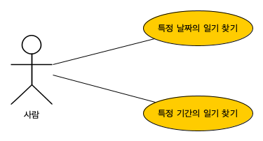

# Daily

최대 하루 한 건의 데이터가 생기는 경우의 매핑.

## 기능

1. 특정 날짜의 일기 찾기.
1. 특정 기간의 일기 찾기.

## Class Diagram

클래스 다이어그램 만으로는 같아 보이지만, 인스턴스의 아이덴티티(`@Id`)를 무엇을 기준으로 판단할 것인가가 다르다.

`Diary2`는 `Person2`의 아이덴티티에 의존해서 아이덴티티를 가진다. 유효한(영속적인) `Person2` 없이는 존재할 수 없는 데이터라는 뜻.

### Person, Diary

양쪽 다 `long` 타입의 ID를 가지는 경우.

### Person2, Diary2

- `Person2`만 `long` 타입의 ID를 가짐.
- `Diary2`는 `Person2`의 구성요소로, `(Person2.id, date)`를 ID로 가짐.

### ERD

[MWB](db/jpa-daily.mwb), [DDL](db/jpa-daily.sql)

- `diary`는 `auto_increment`의 대체키(Alternative Key)를 PK로 사용.
- `diary2`는 AI 없이 복합키 `(person, date)`를 PK로 사용.
